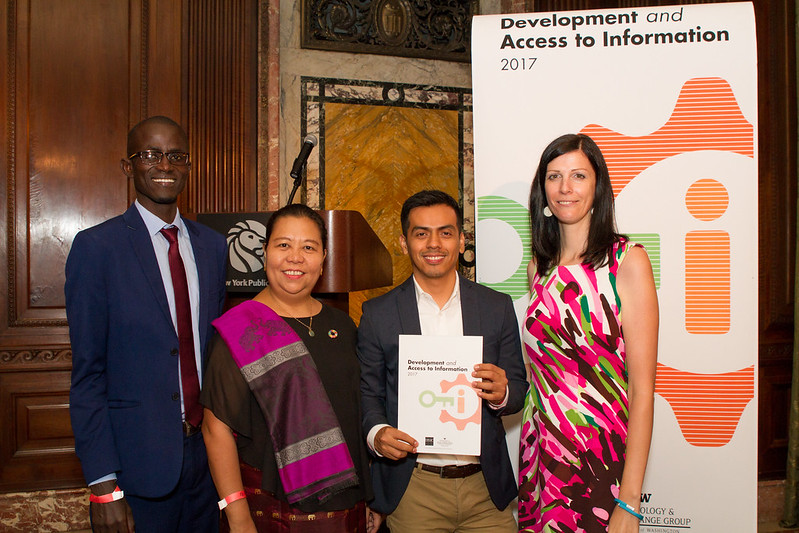
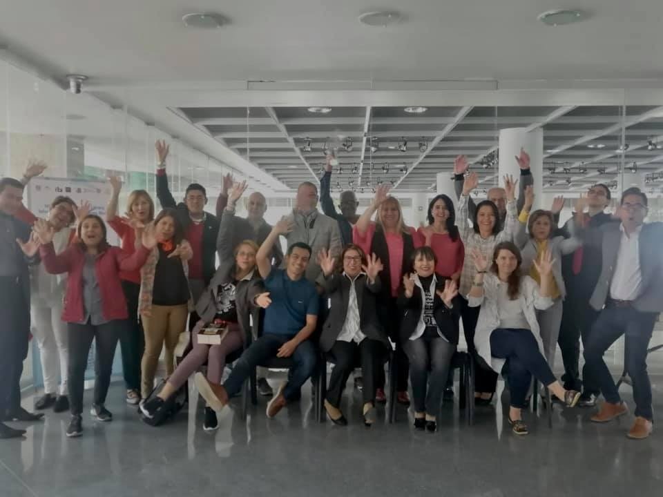
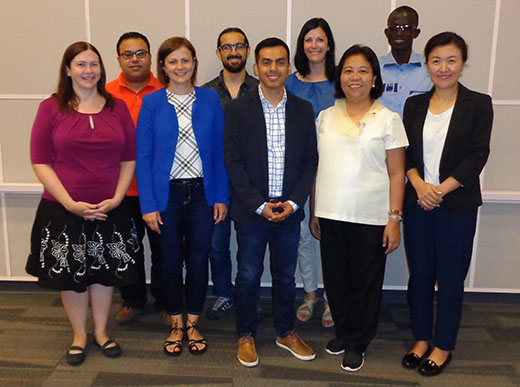

It has been a great privilege for me to be a member of the Governing Board for the last two years working with great colleagues from around the world. I have gained a great understanding of the workings, capabilities, and challenges that face our Federation.

I've been active for nearly 10 years in IFLA; working closely with the LAC Region, and the FAIFE Committee, being part of the second cohort of the IFLA International Leaders, advocating for Access to Information, working on several IFLA initiatives as the Global Vision, the IFLA Strategy and the new Governance. This experience has encouraged me to continue working for IFLA with strong convictions; connecting and empowering the library field, expanding opportunities for new librarians, and building strong relationships with strategic allies.

## **Advocacy, Talks, and Interviews**

## [Understanding Infodiversity: An Interview](https://www.ifla.org/ES/node/93576)

## [Partners for Literacy: IFLA Underlines Contribution of Libraries at Global Meeting](https://www.ifla.org/ES/node/91755)

## [The importance of access to information to achieve sustainable development in Latin America and the Caribbean](https://www.ifla.org/node/37053)

## [Trade Deals Should Favour, not Restrict, Access to Knowledge](https://www.ifla.org/node/18575)

## [Facial Recognition, Libraries, and Intellectual Freedom (FAIFE Speak Up! Blog) ](https://blogs.ifla.org/faife/2019/08/19/facial-recognition-libraries-and-intellectual-freedom/)

## [FAIFE Webinar Track and Trace: Covid 19 and Library Privacy](https://www.youtube.com/watch?v=0C2yCubkqT4&t=2576s)

<iframe width="560" height="315" src="https://www.youtube.com/embed/0C2yCubkqT4" frameborder="0" allow="accelerometer; autoplay; clipboard-write; encrypted-media; gyroscope; picture-in-picture" allowfullscreen></iframe>

# IFLA LAC

### [IFLA LAC MidTerm Meeting 2020](https://www.ifla.org/node/92866)

### [Webinar IFLA LAC Reforma](https://www.ifla.org/ES/node/93443)

### [Seminario Internacional "Las bibliotecas, las actividades de defensa y promoción y la implementación de la agenda 2030.](https://www.ifla.org/files/assets/lac/programachileesp.pdf)

# IFLA International Leadership Programme

### [Associates Announced](https://www.ifla.org/node/10587)

### [From the Annual Conference 2016 ](https://www.ifla.org/ES/node/10801)

### [Internet Governance Forum 2016](https://www.ifla.org/node/11031)

# Working with Libraries and Library Associations 

Speaker at Dag Hammarskjöld UN Library Insight Series.

[The Contribution of Libraries to the Fight Against Misinformation.](https://research.un.org/conferences/webinars)
 <iframe width="560" height="315" src="https://www.youtube.com/embed/hyBMnVZhcMU" frameborder="0" allow="accelerometer; autoplay; clipboard-write; encrypted-media; gyroscope; picture-in-picture" allowfullscreen></iframe>

Speaker at National Library of Perú 

[Lectura, Biblioteca y Comunidad ](http://aulavirtual.bnp.edu.pe/course/view.php?id=9)

Speaker at Guatemala Library Association 

[Tecnologia en tiempos de pandemia](https://www.youtube.com/watch?v=CfVZN9NUmOQ)

Speaker at Biblioteca del Congreso de la Nación - Chile 

El rol del Acceso Publico  uhrf In