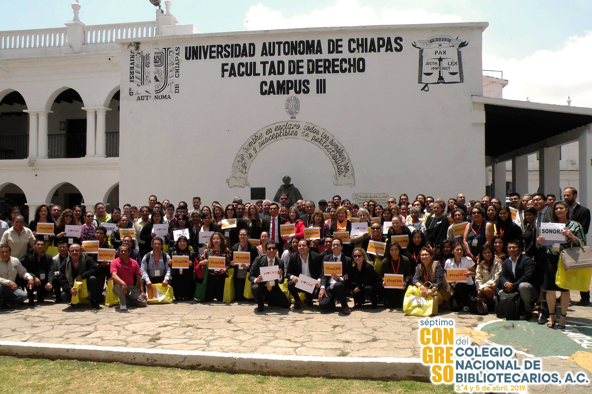

It has been a great privilege for me to be a member of the Governing Board for the last two years working with great colleagues from around the world. I have gained a great understanding of the workings, capabilities, and challenges that face our Federation.

I've been active for nearly 10 years in IFLA; working closely with the LAC Region, being part of the second cohort of the IFLA International Leaders, with FAIFE, advocating for Access to Information, working on several IFLA initiatives as the Global Vision, the IFLA Strategy and the new Governance. This experience has encouraged me to continue working for IFLA with strong convictions; connecting and empowering the library field, expanding opportunities for new librarians, and building strong relationships with strategic allies.

## **Advocacy, Talks, and Interviews**

**Advocacy**\
[Partners for Literacy: IFLA Underlines Contribution of Libraries at Global Meeting](https://www.ifla.org/ES/node/91755)

[Trade Deals Should Favour, not Restrict, Access to Knowledge](https://www.ifla.org/node/18575)

[The importance of access to information to achieve sustainable development in Latin America and the Caribbean](https://www.ifla.org/node/37053)

 **Interviews**  \
IFLA\
[Understanding Infodiversity: An Interview](https://www.ifla.org/ES/node/93576)

ALA International Leads\
 [A check in with Librarians from around the world](http://www.ala.org/rt/sites/ala.org.rt/files/content/intlleads/leadsarchive/201906r.pdf)

**IFLA Publications** 

FAIFE Speak Up! Blog\
[Facial Recognition, Libraries, and Intellectual Freedom ](https://blogs.ifla.org/faife/2019/08/19/facial-recognition-libraries-and-intellectual-freedom/)

Conference paper\
Pun, R., Nangle, D., & Hernández, J. (2017). [Libraries and Gender ♂♀ Neutral / Inclusive Bathrooms: Case Studies on Promoting Information, Inclusivity and Access in Open Spaces](http://library.ifla.org/1670/1/113-pun-en.pdf).

Hernández, J. (2010) [The interactions between Google and librarianship: The Experience of Mexico](https://www.ifla.org/past-wlic/2010/140-hernandez-en.pdf).  

**FAIFE Webinar**\
[FAIFE Webinar Track and Trace: Covid 19 and Library Privacy](https://www.youtube.com/watch?v=0C2yCubkqT4&t=2576s)

<iframe width="560" height="315" src="https://www.youtube.com/embed/0C2yCubkqT4" frameborder="0" allow="accelerometer; autoplay; clipboard-write; encrypted-media; gyroscope; picture-in-picture" allowfullscreen></iframe>

## **IFLA LAC**

[IFLA LAC MidTerm Meeting 2020](https://www.ifla.org/node/92866)

[Webinar IFLA LAC Reforma](https://www.ifla.org/ES/node/93443)

[Seminario Internacional "Las bibliotecas, las actividades de defensa y promoción y la implementación de la agenda 2030.](https://www.ifla.org/files/assets/lac/programachileesp.pdf)

###### [Associates Announced](https://www.ifla.org/node/10587)

###### [From the Annual Conference 2016 ](https://www.ifla.org/ES/node/10801)

###### [Internet Governance Forum 2016](https://www.ifla.org/node/11031)

## **Working with Libraries, Library Associations and Institutions**

\
**Dag Hammarskjöld UN Library Insight Series.**\
[The Contribution of Libraries to the Fight Against Misinformation.](https://research.un.org/conferences/webinars)

 <iframe width="560" height="315" src="https://www.youtube.com/embed/hyBMnVZhcMU" frameborder="0" allow="accelerometer; autoplay; clipboard-write; encrypted-media; gyroscope; picture-in-picture" allowfullscreen></iframe>

**National Library of Perú** **(BNP)**\
[Lectura, Biblioteca y Comunidad ](http://aulavirtual.bnp.edu.pe/course/view.php?id=9)

**American Library Association (ALA)**\
[An International Leaders Forum](https://www.eventscribe.com/2019/ALA-Annual/fsPopup.asp?Mode=presInfo&PresentationID=499414)

**Mexican Library Association (AMBAC)**\
[Las Bibliotecas en el contexto del Desarrollo Sostenible](https://www.youtube.com/watch?v=INGsXE0nO5g)

**Guatemala Library Association (ABG)**\
[Tecnologia en tiempos de pandemia](https://www.youtube.com/watch?v=CfVZN9NUmOQ)

**L’Enssib à Lyon / L’Association des bibliothécaires de France / Comité français international bibliothèques et documentation - CFIBD** \
[Nouveaux bibliothécaires dans un monde qui change.](http://nouveauxbibliothecaires.cfibd.fr/)

](cfibd.jpg "[Nouveaux bibliothécaires dans un monde qui change.](http://nouveauxbibliothecaires.cfibd.fr/)")

**Biblioteca del Congreso de la Nación - Chile** \
[El rol del Acceso Publico a Internet en la Implementación de la Agenda 2030](https://www.youtube.com/watch?v=oaXdHmzHlXY&t=54s)

**Wikimedia México** \
[Bibliotecas y Cultura Libre](https://www.facebook.com/watch/live/?v=2554067794805266&ref=watch_permalink) 

## Mexican Professional Library Association (CNB) 

**President 2017-2019** \
Here's a picture of our 2019 Conference at Chiapas, Mexico.

